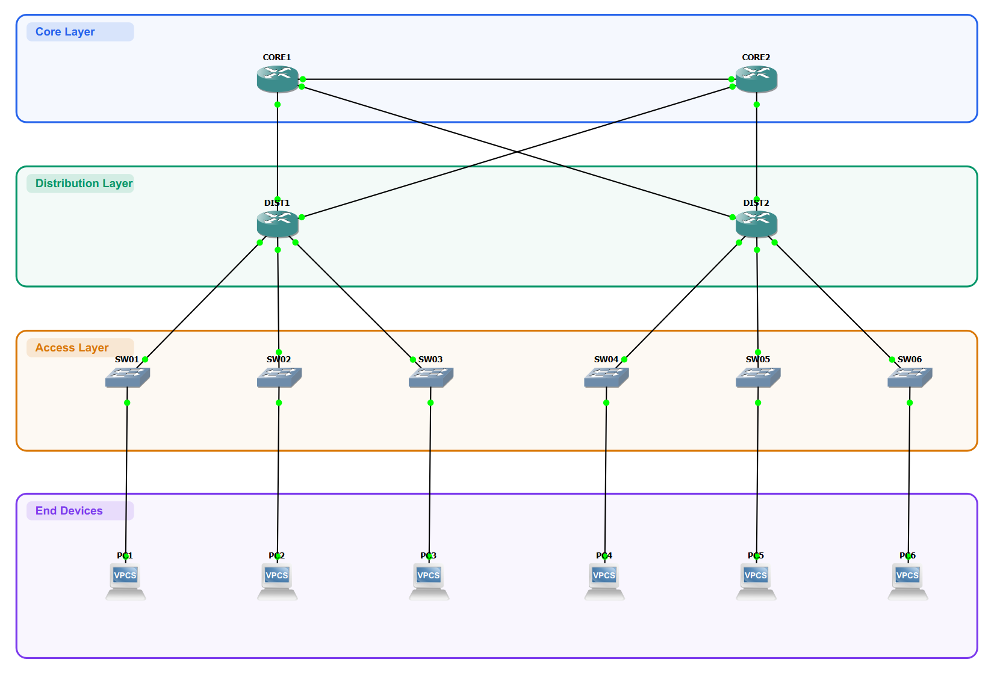

# Network Management Automation with Python

# Assignment Requirements

**1. Use GNS3 / containerlab.dev / or EVE-NG to emulate a network topology:**
- Number of devices: `>= 20` (Router + Switch)
- Vendor: not limited
- Propose a deployment topology

**2. Propose a Python-based solution to automate network operation and management:**
- Network inventory: define the device information required for automation (`.csv` / `.yaml` / `.json` / ...), such as `hostname`, `interface`, and other related fields
- Scope: deploy configuration and validate that devices match the defined state; routing, status monitoring (device, interface, route, ping, ...)

**3. Use Python to implement the solution proposed in section 2**

# 1. Network Emulation

## Network topology



## Provisioning

Use command

Run server:

```powershell
powershell -ExecutionPolicy Bypass -File .\gns3\scripts\start_gns3_local.ps1
```

Create devices:

```powershell
python .\gns3\scripts\create_topology.py
```

- The topology script reconciles the existing project instead of creating a new project every time
- It creates missing nodes and links, keeps valid existing ones, and removes extra ones that are no longer in the topology plan
